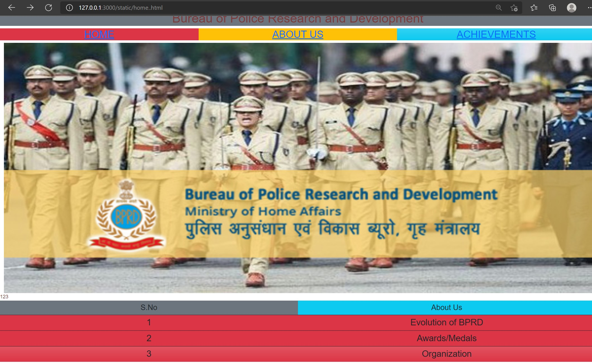
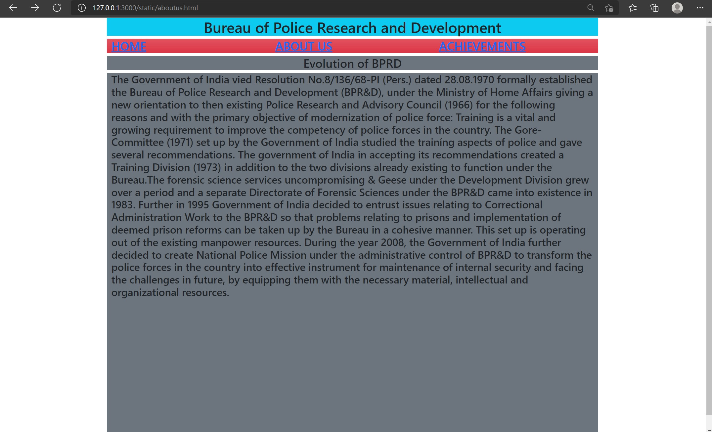
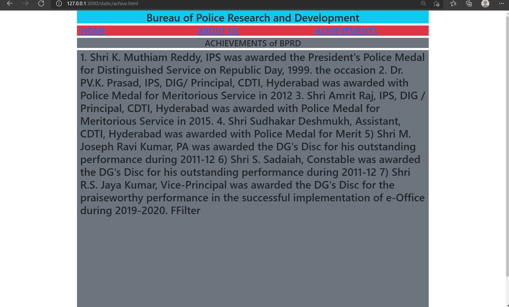

# Web Design using Bootstrap Framework

## AIM:
To design a website using bootstrap framework.

## DESIGN STEPS:

### Step 1:

Requirement collection.

### Step 2:

Creating the layout using bootstrap grid system.

### Step 3:

Updating the sample content.

### Step 4:

Choose the appropriate style and color scheme.

### Step 5:

Validate the layout in various browsers.

### Step 6:

Validate the HTML code.

### Step 6:

Publish the website in the given URL.

## PROGRAM :
HOME PAGE
~~~
<!DOCTYPE html>
<html lang="en">
<head>
    <meta charset="UTF-8">
    <meta http-equiv="X-UA-Compatible" content="IE=edge">
    <meta name="viewport" content="width=device-width, initial-scale=1.0">
    <title>Bootstrap Website</title>
    <link rel="stylesheet" href="./css/layout.css" />
    <link href="https://cdn.jsdelivr.net/npm/bootstrap@5.0.2/dist/css/bootstrap.min.css" rel="stylesheet" integrity="sha384-EVSTQN3/azprG1Anm3QDgpJLIm9Nao0Yz1ztcQTwFspd3yD65VohhpuuCOmLASjC" crossorigin="anonymous">

</head>
<body>
    

        

    

        

            
Bureau of Police Research and Development

            
<a href="/static/sample.html">HOME</a>

            
<a href="/static/aboutus.html">ABOUT US</a>

            
<a href="/static/achive.html">ACHIEVEMENTS</a>

            
            <table class="table">
                <thead>
                    <tr>
                        <th  class="h4 bg-secondary" scope="col">S.No</th>
                        <th class="h4 bg-info" scope="col">About Us</th>
                    </tr>
                <tbody>
                    <tr scope="row">1</tr>
                    <td class="col-sm-6 h3 bg-danger bg-secondary">1</td>
                    <td class="col-sm-6 h3 bg-danger bg-secondary">Evolution of BPRD</td>
                </tbody>
                <tbody>
                    <tr scope="row">2</tr>
                    <td class=" col-sm-3 h3 bg-danger bg-info">2</td>
                    <td class=" col-sm-3 h3 bg-danger bg-info">Awards/Medals</td>
                </tbody>
                <tbody>
                    <tr scope="row">3</tr>
                    <td class=" col-sm-3 h3 bg-danger bg-gradient">3</td>
                    <td class=" col-sm-6 h3 bg-danger bg-gradient">Organization</td>
                </tbody>
            </thead>
            </table>
        

      

 </body>
</html>
~~~
ABOUT US
~~~ 
    <!DOCTYPE html>
<html lang="en">
<head>
    <meta charset="UTF-8">
    <meta http-equiv="X-UA-Compatible" content="IE=edge">
    <meta name="viewport" content="width=device-width, initial-scale=1.0">
    <title>Bootstrap Website</title>
    <link href="https://cdn.jsdelivr.net/npm/bootstrap@5.0.2/dist/css/bootstrap.min.css" rel="stylesheet" integrity="sha384-EVSTQN3/azprG1Anm3QDgpJLIm9Nao0Yz1ztcQTwFspd3yD65VohhpuuCOmLASjC" crossorigin="anonymous">

</head>
<body>
    

        

            
Bureau of Police Research and Development

            
<a href="/static/sample.html">HOME</a>

            
<a href="/static/aboutus.html">ABOUT US</a>

            
<a href="/static/achive.html">ACHIEVEMENTS</a>

            <h2 class="text-center bg-secondary">Evolution of BPRD</h2>

            
The Government of India vied Resolution No.8/136/68-PI (Pers.) dated 28.08.1970 formally
                established the Bureau of Police Research and Development (BPR&D), under the Ministry of Home
                Affairs giving a new orientation to then existing Police Research and Advisory Council (1966) for the
                following reasons and with the primary objective of modernization of police force: Training is a vital
                and growing requirement to improve the competency of police forces in the country. The
                Gore-Committee (1971) set up by the Government of India studied the trainíng aspects of police and
                gave several recommendations. The government of India in accepting its recommendations created
                a Training Division (1973) in addition to the two divisions already existing to function under the
                Bureau.The forensic science services uncompromising & Geese under the Development Division
                grew over a period and a separate Directorate of Forensic Sciences under the BPR&D came into
                existence in 1983.
                Further in 1995 Government of India decided to entrust issues relating to Correctional
                Administration Work to the BPR&D so that problems relating to prisons and implementation of
                deemed prison reforms can be taken up by the Bureau in a cohesive manner. This set up is operating
                out of the existing manpower resources.
                During the year 2008, the Government of India further decided to create National Police Mission
                under the administrative control of BPR&D to transform the police forces in the country into
                effective instrument for maintenance of internal security and facing the challenges in future, by
                equipping them with the necessary material, intellectual and organizational resources.

        </body>
        </html>
~~~   
ACHIEVEMENTS
~~~
<!DOCTYPE html>
<html lang="en">
<head>
    <meta charset="UTF-8">
    <meta http-equiv="X-UA-Compatible" content="IE=edge">
    <meta name="viewport" content="width=device-width, initial-scale=1.0">
    <title>Bootstrap Website</title>
    <link href="https://cdn.jsdelivr.net/npm/bootstrap@5.0.2/dist/css/bootstrap.min.css" rel="stylesheet" integrity="sha384-EVSTQN3/azprG1Anm3QDgpJLIm9Nao0Yz1ztcQTwFspd3yD65VohhpuuCOmLASjC" crossorigin="anonymous">

</head>
<body>
    

        

            
Bureau of Police Research and Development

            
<a href="/static/sample.html">HOME</a>

            
<a href="/static/about.html">ABOUT US</a>

            
<a href="/static/achive.html">ACHIEVEMENTS</a>

            <h2 class="text-center bg-secondary">ACHIEVEMENTS of BPRD</h2>
            
1. Shri K. Muthiam Reddy, IPS was awarded the President's Police Medal for Distinguished Service on
                Republic Day, 1999.
                the occasion
                2. Dr. PV.K. Prasad, IPS, DIG/ Principal, CDTI, Hyderabad was awarded with Police Medal for Meritorious Service in
                2012
                3. Shri Amrit Raj, IPS, DIG / Principal, CDTI, Hyderabad was awarded with Police Medal for Meritorious Service in
                2015.
                4. Shri Sudhakar Deshmukh, Assistant, CDTI, Hyderabad was awarded with Police Medal for Merit
                5) Shri M. Joseph Ravi Kumar, PA was awarded the DG's Disc for his outstanding performance during 2011-12
                6) Shri S. Sadaiah, Constable was awarded the DG's Disc for his outstanding performance during 2011-12
                7) Shri R.S. Jaya Kumar, Vice-Principal was awarded the DG's Disc for the praiseworthy performance in the
                successful implementation of e-Office during 2019-2020.
                FFilter
               

</body>
</html>
~~~
## OUTPUT:

### Home Page:

## Result:

